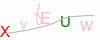

# nodejs 验证码模块
这是一个基于 ImageMagick 封装实现的一个nodejs验证码生成库（生成gif验证码图片）, 使用该库必须要安装ImageMagick。   
其实我在老早之前用的一个叫 ”gm“ 的npm包实现过验证码；这次弃用了该依赖直接对 ImageMagick 命令进行了封装，依赖更少更得劲。   

## 效果展示
[点这里查看在线示例](http://examples.lilin.site/captcha)   




## 使用示例
代码示例（Javascript）：
```js
// 配置，可选的
let options = {
    // 验证码所要用到的颜色集合
    colors: ["red", "blue", "pink", "green", "grey"],
    height: 40,
    width: 100,
    // 验证码绘制文字池子， 缺省为26个字母加阿拉伯数字
    chars: [],
    // 画几条干扰线
    line: 3,
    // 画几条贝塞尔曲线
    bezier: 2,
    // 画几个干扰点
    point: 50,
    background: "#fff"
}

//（2）
let captcha = require("captcha")(options);

require("http").createServer((req, res) => {
    const { code, stream } = await captcha(); // 这里option可选，若传入会临时覆盖（2）处所传入的option。 
    console.log(code);
    stream.pipe(res);
}).listen(80, () => console.log("测试服务已启动！"))；
```

代码示例（Typescript）:   
```ts
// tsconfig.json
{
    compileOptions: {
        // 此项开启必须
        "esModuleInterop": true,
        // more ...
    }
}

// 服务器
import captcha, { CaptchaOptions, CaptchaFunction } from "captcha";
import http, { Server, ServerResponse, IncomingMessage } from "http";
import { Readable } from "stream";
const cp: CaptchaFunction = captcha();
const app: Server = http.createServer(async (req: IncomingMessage, res: ServerResponse) => {
    const { stream, code } = await cp();
    stream.pipe(res);
});
app.listen(80, () => {
    console.log("服务运行....");
});
```