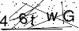

# nodejs 验证码模块
该模块依赖ImageMagick；且版本必须为7.0+。  

## 效果




## 使用
代码示例：
```js
// 配置，可选的
let options = {
    // 验证码所要用到的颜色集合
    colors: ["red", "blue", "pink", "green", "grey"],
    height: 40,
    width: 100,
    // 验证码绘制文字池子， 缺省为26个字母加阿拉伯数字
    chars: [],
    // 画几条干扰线
    line: 3,
    // 画几个干扰点
    point: 50,
    background: "#fff"
}

//（2）
let captcha = require("captcha")(options);

require("http").createServer((req, res) => {
    const { code, stream } = await captcha(); // 这里option可选，若传入会临时覆盖（2）处所传入的option。 
    console.log(code);
    stream.pipe(res);
}).listen(80, () => console.log("测试服务已启动！"))；
```
